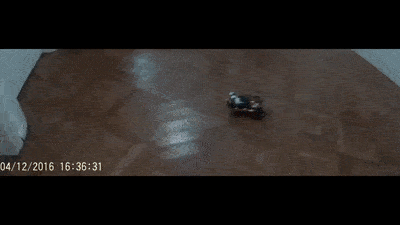
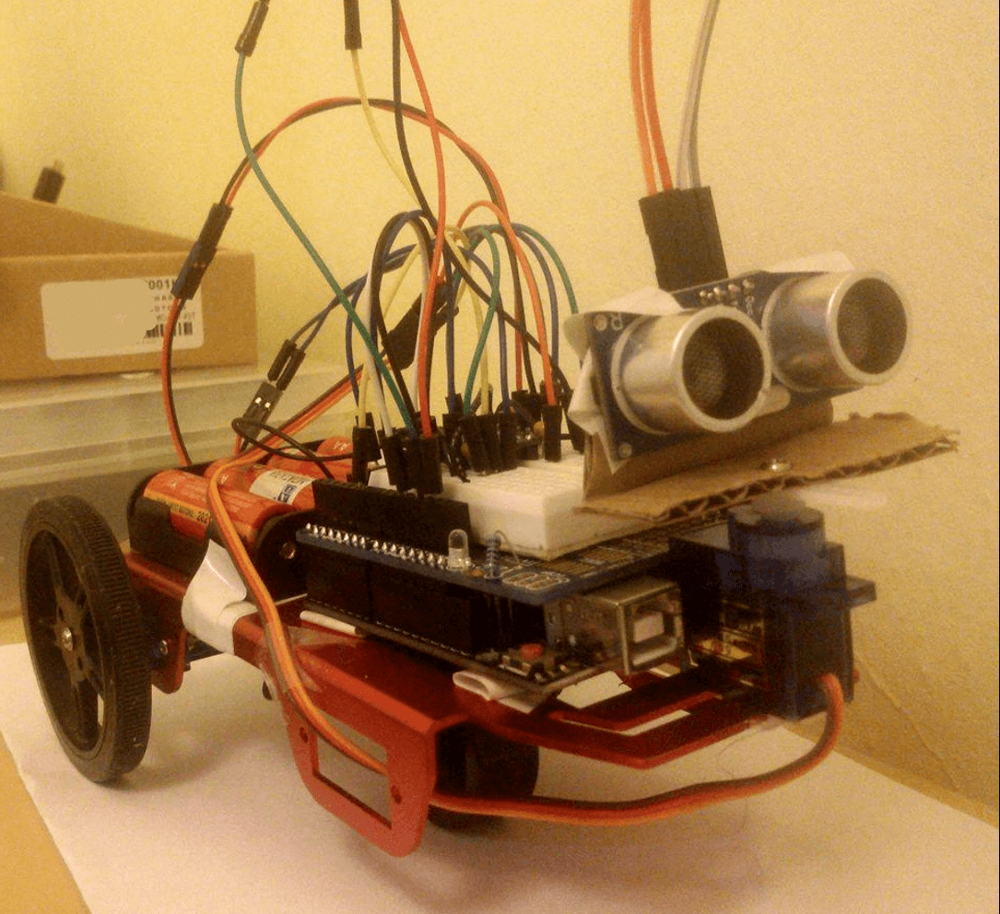

# sonar-vehicle

  

### Description
A 3-wheel vehicle that moves autonomously avoiding obstacles with SONAR

### Prerequisites

- An AVR micro-controller (I used ATmega328P) and a board to plug it AKA: [Arduino UNO](https://image.slidesharecdn.com/arduinounoatmega328-151028115931-lva1-app6891/95/arduino-uno-atmega328-5-638.jpg?cb=1446033702)
- AA [Batteries](https://encrypted-tbn0.gstatic.com/images?q=tbn:ANd9GcRMM5Rv62q8PDadNzyNP1a4CVt3B_raLvxWcaFju3ADlQST6xch) to power your board 
- A [Chasis](https://cdn-shop.adafruit.com/1200x900/2943-01.jpg) for your vehicle
- Two DC [motors](https://cdn-shop.adafruit.com/1200x900/2941-00.jpg) in in micro servo body and a couple of [wheels](https://encrypted-tbn0.gstatic.com/images?q=tbn:ANd9GcQ4cqBrJ4y_WUmKC7xQ7gbtW5wmvfUwopOnDSMFwQjpPdqmb_srEw)
- A dual motor [DVR8835](https://a.pololu-files.com/picture/0J4056.1200.jpg?c04dc0dba6293777436f8a523565e9e6) driver to control your motors  
- One [Sonar](https://encrypted-tbn0.gstatic.com/images?q=tbn:ANd9GcTRso0kVEqLfiMTnVRxTI-7g9OpNEy1VnnYd1zTDFp2LSedhVNY) to avoid obstacles 
- A [Servo Motor](http://www.electronicwings.com/public/images/user_images/images/Arduino/Servo%20Motor/servo.jpg) to look move the SONAR
- A [breadboard](https://www.circuitspecialists.com/content/175324/wb-801-0.jpg) and bunch of [wires](https://i.stack.imgur.com/y7eu5.jpg) and [resistors](https://i.ebayimg.com/images/g/ZHUAAOxyqKVRizNa/s-l300.jpg)

And finally you're going to need a tool like Atmel Studio to compile and produce the .hex which you will load to the AVR with a program like XLoader.

### Vehicle Close-up

